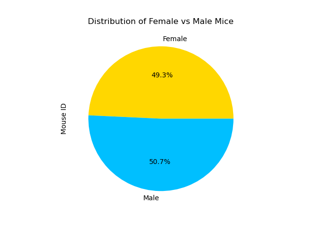

# clinical-study-visualizations
Pandas + Matplotlib Visualizations - Data Analytics Course Module 5

# Task
Using data generated for a hypothetical pharmaceutical company specializing in anti-cancer medications, I will generate tables and figures needed for a technical report of the clinical study.

# Methodology
- Prepare the data.
- Generate summary statistics.
- Create bar charts and pie charts.
- Calculate quartiles, find outliers, and create a box plot.
- Crate a line plot and a scatter plot.
- Calculate correlation and regression.

# Results

Bar Chart:

Pie Chart:

Box Plot:

Line Plot:

Scatter Plot:

Correlation and Regression:

# Analysis

## Observation 1
There is a strong correlation (.84) and close relationship (as shown by the linear regression) between mouse weight and tumor volume. That is, mice with greater mass showed larger tumor volume.

## Observation 2
The line plot "Measurements for Mouse b128 Treated with Capomulin" shows that over time, Capomulin treatments resulted in smaller tumor volume in Mouse b128.

## Observation 3
The bar graphs "Timepoints per Regimen" indicate that Capomulin and Ramicane had substantially more timepoints than other treatments. This may result in more complete and comprehensive data results than other treatments that used fewer timepoints.

