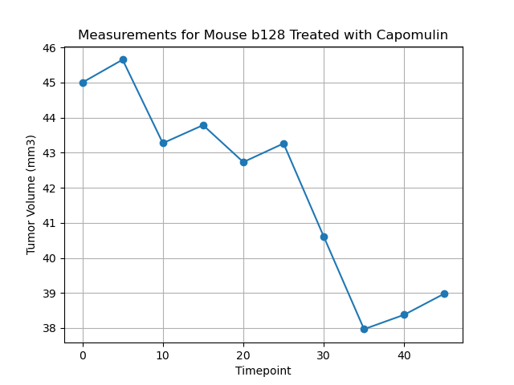
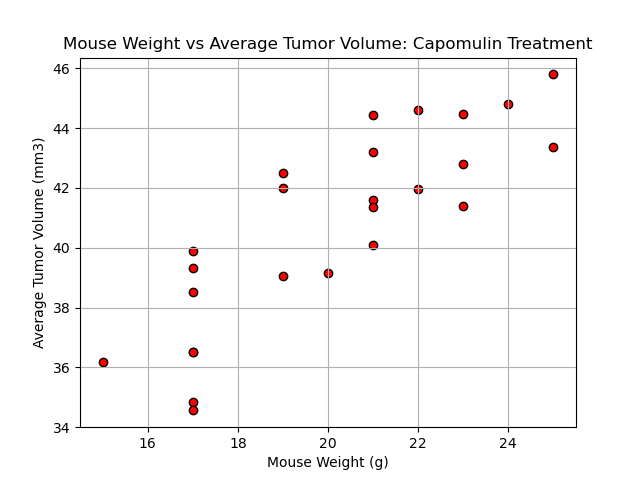
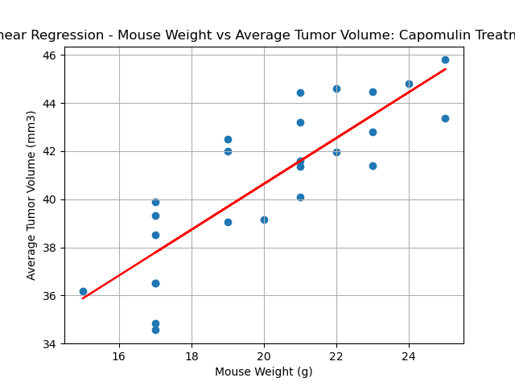

# clinical-study-visualizations
Pandas + Matplotlib Visualizations - Data Analytics Course Module 5

# Task
Using data generated for a hypothetical pharmaceutical company specializing in anti-cancer medications, I will generate tables and figures needed for a technical report of the clinical study.

# Methodology
- Prepare the data.
- Generate summary statistics.
- Create bar charts and pie charts.
- Calculate quartiles, find outliers, and create a box plot.
- Crate a line plot and a scatter plot.
- Calculate correlation and regression.

# Results

Bar Chart:

Pie Chart:

Box Plot:

Line Plot:

Scatter Plot:

Correlation and Regression:

